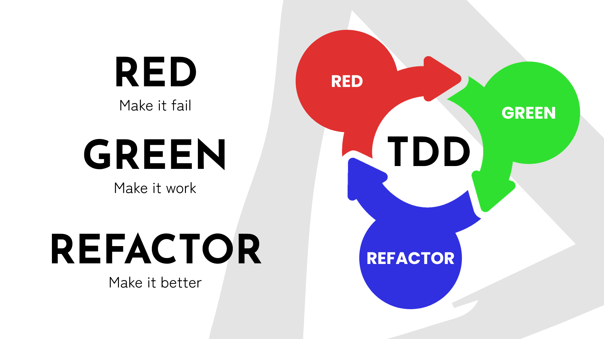

# Test-Driven Development (TDD)

Le Test-Driven Development (TDD) est une méthodologie de développement par une refactorisation continue, qui consiste à
écrire les tests unitaires autorisant la refactorisation, avant d'écrire le code de production à refactoriser.

## Cycle du TDD

Le TDD propose trois étapes principales

### Red

> Make it fail

Faites échouer votre code !

Écrire un test unitaire et l'exécuter pour s'assurer qu'il échoue.

Le test que l'on écrit définit une fonctionnalité ou une amélioration qui n'existe pas encore.
Le code lui-même n'existe pas, et on peut se retrouver à avoir des erreurs de compilation (dans le cas des languages
compilés), ou utiliser des structures ou des fonctions inexistantes, mais désirées.

À la fin de la phase RED, notre code compile, et le test qu'on a écrit échoue our une bonne raison : l'absence du code
de prod qui permet de le faire passer.

### Green

> Make it pass

Faites fonctionner votre code !

Écrire le code le plus simple possible, permettant de faire passer le test.

Tous les coups sont permis, que ce soit d'écrire des valeurs en dur, d'implémenter une solution partielle ou
d'implémenter une solution évidente. L'objectif étant de faire passer le test, et non pas d'implémenter la
fonctionnalité.

### Refactor

> Make it better

Faites briller votre code !

Prenez le temps de retravailler votre code à tête reposée, sans pression.
Refactorisez en améliorant la structure de votre code, sans en altérer le comportement : vous avez des tests qui le
garantissent.

Prenez également le temps de refactoriser vos tests unitaires. Plus vous faites des étapes petites, plus vous aurez
des "micro-test" (en effet de bord), qui n'ont pas vocation à survivre au développement.

Choisissez les tests unitaires que vous voulez garder.

## Les trois règles du TDD

Une personne influence a résumé le TDD en trois règles :

1. You are not allowed to write any production code unless it is to make a failing unit test pass.
2. You are not allowed to write any more of a unit test than is sufficient to fail; and compilation failures are failures.
3. You are not allowed to write any more production code than is sufficient to pass the one failing unit test.

Ce que nous comprenons de la façon suivante

### Permis de coder

> You are not allowed to write any production code unless it is to make a failing unit test pass.

Interdit d’écrire du code, sans test en échec qui prouve que ce code est nécessaire.

Le TDD est une méthodologie de refactoring en continu. Or, on ne peut pas refactoriser du code qui n'est pas testé.
Ecrire un test nous donne le droit d'écrire le code de production. 

### Une question à la fois

> You are not allowed to write any more of a unit test than is sufficient to fail; and compilation failures are failures.

Interdit d’écrire plus d’un test en échec à la fois

### Connaître les limites

Interdit d’écrire plus de code que nécessaire, pour faire passer le test en cours.

## Mais... je ne sais pas faire du TDD

Si vous ne savez pas faire de TDD, ce n'est pas grave.
Ce n'est pas une fin en soi ; ne vous bloquez pas à cette contrainte pour la journée, et privilégiez votre apprentissage !

Néanmoins, voici quelques pistes si vous voulez profiter de ce temps pour travaille et apprendre cette pratique.

### Lancez vous !

Lors d'une "Code Retreat", nous sommes réunis pour apprendre ; c'est l'opportunité pour vous d'essayer le TDD dans un 
environnement sain.  

- Vous pouvez vous faire aider par les facilitateur·ices de la journée pour vous guider.
- Vous pouvez vous trouver un binôme de confiance qui vous guidera dans vos premiers pas. 

### Kent Beck - TDD workflow for beginners

> Let's say you interested in TDD but you just can't figure out how to write a test before you write the code. 
> Here's a foolproof exercise that let's you experience the TDD workflow in spite of that block:
>
> 1. Change the code as usual
> 2. Write a test that only passes after the change
> 3. Revert to before 1
> 4. Type the test again (copy/paste is cheating & invalidates the warranty of the exercise)
> 5. Make it compile by changing the code
> 6. See it fail
> 7. Change the code to make it pass
>
> If you try this exercise, I’d like to see a screencast of it and hear your reaction.
>  
> Kent Beck, https://x.com/kentbeck/status/1421257648914137090
