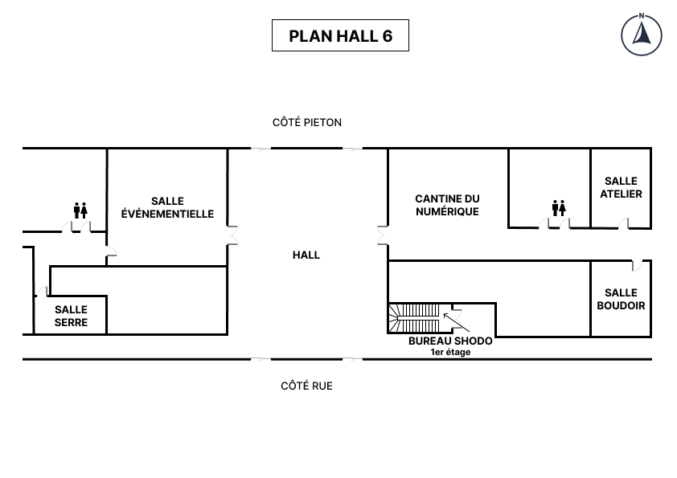

# 🍂 Shodo Autumn Code Retreat 2024 ⛩️

> **🗓️ Quand ?**   Lundi 04 novembre 2024
>
> **📍Où ?**
>   A la Cantine Numérique, dans la salle événementielle pour le lancement de la journée
<!-- more -->

## Agenda

| 🕓 9h-9h30     | Accueil & Petit déjeuner            |
|----------------|-------------------------------------|
| 🕓 9h30-10h00  | Présentation de la journée          |
| 🕓 10h00-11h00 | Itération \#1                       |
| 🕓 11h00-12h00 | Itération \#2                       |
| 🕓 12h00-14h   | 🍕 Déjeuner 🍕                      |
| 🕓 14h-15h     | Itération \#3                       |
| 🕓 15h-16h     | Itération \#4                       |
| 🕓 16h-17h     | Itération \#5                       |
| 🕓 17h-17h30   | Debrief et conclusion de la journée |

## Lieux

Pair programming:

- Salle événementielle

Mob programming:

- Serre
- Atelier (matin) et Boudoir (après-midi)

## Le Kata

[🟡 Pac Man]

## Déroulé de la journée

À chaque itération :

- Vous devez changer de binôme (ou aller dans la salle de mob-programming)
- Vous choisissez le langage que vous voulez utiliser
- Vous appliquez la ou les contraintes de l'itération
 
🎓 Favorisez l'apprentissage plutôt que de rester bloqué·e.

🧑‍⚖️ Vous ne serez pas jugé·e du code que vous produisez (ou que vous ne produisez pas).

### Itération \#1

- [TDD]
- [Pair-Programming]

🎯 Objectif : découvrir le kata

### Itération \#2

> :warning: On continue à travailler en TDD ET en Pair-Programming

- [No Primitives]
- [Règle du "Oui"] + [Strong Style Navigation]

### Itération \#3

> :warning: On continue à travailler en TDD ET en Pair-Programming

- [Code swap] 
- Variation du kata [Pac Man : le score]
- [🖖 Une main chacun]

### Itération \#4

> :warning: On continue à travailler en TDD ET en Pair-Programming

- [Baby steps]
- [Immutable Code]

### Itération \#5

> :warning: On continue à travailler en TDD ET en Pair-Programming

- [No if]
- [Ping-Pong Pair-Programming]


