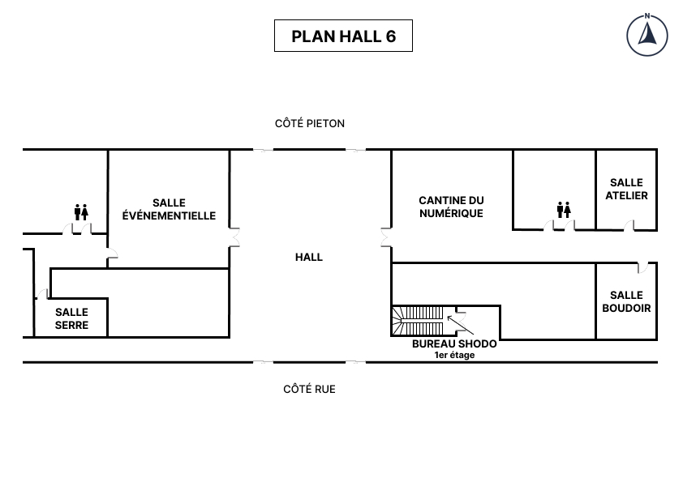

# ⛱️ Shodo Summer Code Retreat 2025 ⛩️

> **🗓️ Quand ?**   xx juillet 2025
>
> **📍Où ?**
>   A "L'Atelier" à la Cantine Numérique
<!-- more -->

## Agenda

| 🕓 9h-9h30     | Accueil & Petit déjeuner Présentation de la journée        |
|----------------|-------------------------------------|
| 🕓 9h30-11h00  | Itération \#1                       |
| 🕓 11h00-12h30 | Itération \#2                       |
| 🕓 12h30-14h   | 🍕 Déjeuner 🍕                      |
| 🕓 14h-15h30   | Itération \#3                       |
| 🕓 15h30-17h   | Itération \#4                       |
| 🕓 17h-17h30   | Debrief et conclusion de la journée |

!!! experiment "Expérimentation"

    Le format est différent des Code Retreat "classiques" : on planifie de faire 4 créneaux plus longs que les créneaux habituels.

## Le Kata

[🪤 Pokémon]

## Thème

Les contraintes de cette journée, sont réfléchies pour nous faire découvrir les concepts de l'[Event-Driven Architecture].

## Déroulé de la journée

À chaque itération :

- Vous devez changer de binôme
- Vous choisissez le langage que vous voulez utiliser
- Vous appliquez la ou les contraintes de l'itération
 
🎓 Favorisez l'apprentissage plutôt que de rester bloqué·e.

🧑‍⚖️ Vous ne serez pas jugé·e du code que vous produisez (ou que vous ne produisez pas).

### Itération \#1

- [TDD]
- [Pair-Programming]

🎯 Objectif : découvrir le kata

### Itération \#2

> :warning: On continue à travailler en TDD ET en Pair-Programming

- Event Sourcing

🎯 Objectif : TBD

### Itération \#3

> :warning: On continue à travailler en TDD ET en Pair-Programming

- Event-Driven Architecture

🎯 Objectif : TBD

### Itération \#4

> :warning: On continue à travailler en TDD ET en Pair-Programming

- Truc jouable

🎯 Objectif : TBD


