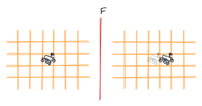
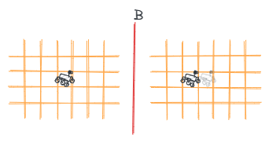
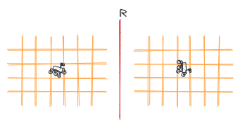
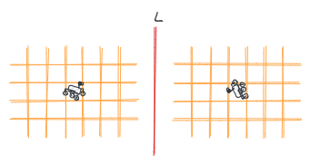

<!-- .slide: data-background-image="../../assets/images/katas/mars-rover/mars-rover-kata-overview.png" data-background-opacity="0.6"-->
# 🛸 Mars Rover

Notes:

- Vous faites partie d'une équipe contrôlant des robots pour explorer Mars, au travers du vide intersidéral
- L'objectif de ce kata est de développer une petite simulation modélisant un robot se déplaçant à la surface de mars.

---

<!-- .slide: data-background-image="../../assets/images/katas/mars-rover/mars-rover-kata-overview.png" data-background-opacity="0.6"-->
## Déplacement du Rover

--

On modélise la surface de Mars comme une grille à deux dimensions.

Le Rover reçoit des commandes qui lui permettent d'évoluer dans ce milieu

--

Le Rover peut avancer d'une case

--

Le Rover peut reculer d'une case

--

Le Rover peut tourner à droite (sens horaire)

--

Le Rover peut tourner à gauche (sens anti-horaire)

---

<!-- .slide: data-background-image="../../assets/images/katas/mars-rover/mars-rover-kata-overview.png" data-background-opacity="0.6"-->
# C'est parti !