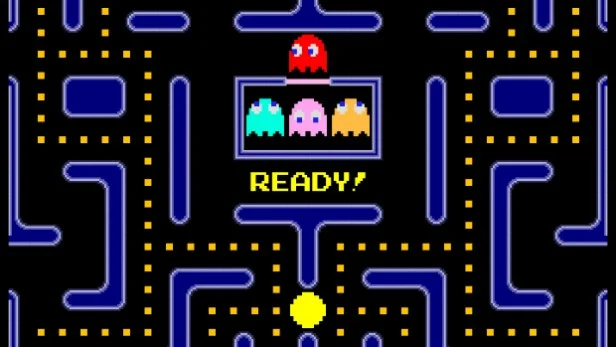
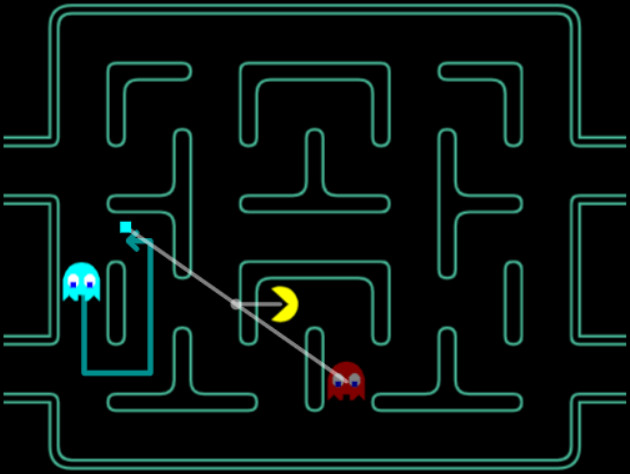
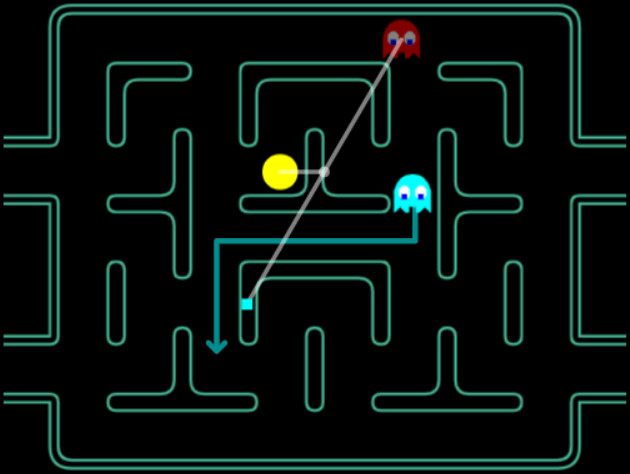

# 🟡 Pac-Man

> Bootstrap :  
> 🔗 https://github.com/shodo-nantes/kata-starters

Pac-Man est un jeu vidéo iconique, et un emblème de l’histoire du jeu vidéo.
Il s'agit d'un personage jaune avec une grande bouche qui se déplace dans un labyrinthe où il mange des pac-gommes.
Mais Pac-Man est la proie de quatre fantômes qui hantent le labyrinthe.

Arrivera-t-il à vider le labyrinthe de ses denrées alimentaires ?

> Pour vous remémorer comment ça fonctionne, vous pouvez jouer ici
> 👉 https://masonicgit.github.io/pacman/

!!! example "Comment ça fonctionne un jeu ?"

    Un jeu vidéo est consititué d'une boucle infinie qui appelle la fonction principale du jeu.    
    Cette fonction principale met à jour l'image affichée aux joueurs (qu'on appelle "frame"), et chaque exécution de la
    fonction principale est appelée un "tick".

    La fonction principale tient compte des informations transmises par les joueur·euses, et l'état du jeu à un "tick" donné,
    pour exécuter le "tick" d'après.

⇒ L'objectif de ce kata est de développer la fonction principale reproduisant le mécanisme de ce célèbre jeu

## 🟡 Pac-Man dans son environnement simplifié

Les spécifications originales de Pac-Man, sont très chouettes, mais ce n'est pas avec ça qu'on va réussir à se mettre en
condition pour apprendre quelque chose.

Simplifions.

#### 🕹️ Déplacement de Pac-Man

Pac-Man évolue dans un labyrinthe en deux dimensions, constitué de _tuiles_ (ou cases).

- Pac-Man avance en permanence, en ligne droite, à la vitesse d'une case/tick
- Pac-Man peut s'orienter dans 4 directions haut, bas, gauche et droite
- Pour changer de direction, Pac-Man reçoit une commande de la part du joueur, il se tourne instantanément dans la
  direction demandée.
- Si Pac-Man atteint le bord du labyrinthe, il traverse de l'autre côté
- Pac-Man est bloqué par les murs

#### 🍕 Se nourrir

Pac-Man collecte des "pacgum" (ou "dots", ou "pellets") au fur et à mesure qu'il se déplace dans le labyrinthe

- Au début de la partie, des "pacgum" sont placés dans le labyrinthe.
    - Pour faire simple : toutes les cases non-murs et non occupées par Pac-Man ou par les fantômes, contiennent un "
      pacgum"
- Pac-Man mange les "pacgum" présents sur les cases qu'il traverse
- Une fois la "pacgum" mangée, elle disparait du labyrinthe
- Quand il n'y a plus de "pacgum" sur le labyrinthe, le niveau est terminé et s'achève par la victoire de Pac-Man.

- Certaines des "pacgum" sont des "super-pacgum" (aka. "energizer", ou "super pellets"), et permettent à Pac-Man
  d'effrayer les fantômes pendant un temps (24 ticks).

### 💯 Score

Pour savoir s'il a bien mangé, Pac-Mac dispose d'un score, qui commence à zéro et qui s'incrémente de la manière suivante : 

- Quand il mange 1 "pacgum", son score augmente de 10 points
- Quand il mange 1 "super-pacgum", son score augmente de 50 points
- Quand il mange des fantômes, son score augmente ainsi :
    - le premier fantôme vaut 200 points
    - le second fantôme vaut 400 points
    - le troisième fantôme vaut 800 points
    - le quatrième fantôme vaut 1600 points
    - Une fois que l'effet d'un "super-pacgum" est terminé, on repart du "premier fantôme" pour déterminer le score.

## 👻 Les fantômes

> L'IA des fantômes est très bien expliquée dans cette vidéo : 
> 📺 [L'IA des fantômes de Pac-Man](https://www.youtube.com/watch?v=ataGotQ7ir8)

Le labyrinthe est hanté par quatre fantômes.

- Ils avancent d'une case à chaque tick
- Ils cherchent à atteindre la case le plus proche de leur objectif
    - En cas d'égalité, ils vont prioriser la case du haut, celle de gauche, celle d'en bas, puis celle de droite.
- Ils ne peuvent jamais retourner dans la case qu'ils ont quitté
- Ils sont bloqués par les murs
- Comme Pac-Man, quand ils arrivent au bord du labyrinthe, ils réapparaissent de l'autre côté

### 💖 Vie

Manger ou être mangé : les fantômes sont une réelle menace pour Pac-Man et peuvent l'empêcher de manger à sa faim.

- Quand Pac-Man et un fantôme partagent la même case, Pac-Man perd une vie et réapparait à son point de départ.
- Le jeu se termine par la défaite de Pac-Man, quand Pac-Man n'a plus de vie.

### 🎭 Comportement des fantômes

Les fantômes adoptent différents comportements qui évoluent dans le temps.
Ils alternent entre les comportements suivants :

- 🏠 Home : le comportement qu'ont les fantômes en début de partie. Ils tournent dans leur emplacement de départ quelques
  instants avant d'adopter le comportement "Scattered".
- 😶‍🌫️ Scattered : les fantômes ciblent une case qui leur a été assigné. Ils conservent ce comportement pendant 7
  secondes (28 ticks) avant d'adopter le comportement "Chase".
- 🎯 Chase : les fantômes chassent Pac-Man pendant 20 secondes (80ticks) et chacun d'eux adopte un comportement qui lui
  est propre, avant d'adopter le comportement "Scattered".
- 😱 Frightened : quand Pac-Man mange un "super-pacgum", les fantômes sont effrayés et fuient Pac-Man pendant 6
  secondes (24 ticks). Si ce denier les attrape, ils sont mangés et adoptent le comportement "Eaten".
- 😋 Eaten : les fantômes reviennent à leur emplacement de départ et adoptent le comportement "Home".

!!! example "Différences avec le jeu réel"

    Le jeu original de Pac-Man présente plein d'autres complexités que nous avons choisi de mettre de côté pour 
    l'exercice 

    - En mode Eaten, une fois qu'ils atteignent leur emplacement de départ, les fantômes adoptent le comportement qu'ils
      avaient avant d'être Frightened
    - A cause d'un bug d'overflow, quand Pac-Man est dirigé vers le haut, la case relative à Pac-Man utilisée pour 
      déterminer la cible des fantômes, est décalée sur la gauche du même nombre de cases que la position relative vers
      le haut
    - Sur 4 cases du labyrinthe (des intersections), les fantômes n'ont pas le droit de s'orienter vers le haut

### ❤️ Blinky (fantôme rouge)

Blinky, également connu pour être l'ombre de Pac-Man, est le fantôme le plus aggressif.

- Il n'adopte jamais le comportement "Home"
- En mode "Scattered", il cible la case en haut à droite du labyrinthe (même si elle n'est pas accessible)
- En mode "Chase", il cible directement Pac-Man

> **Différences avec le jeu réel**
> 
> Dans le jeu réel, Blinky est encore plus agressif :
> 
> - Au bout de 3 changement de compostements "Chase"/"Scattered", Blinky reste en mode "Chase"
> - S'il reste 20 pacgum ou moins dans le labyrithe, Blinky reste en mode "Chase"

### 🩷 Pinky (fantôme rose)

Pinky est un fantôme intelligent, qui va chercher à anticiper la position de Pac-Man pour lui tendre des embuscades.

- Il adopte le comportement "Home" pendant 3 secondes (12 ticks)
- En mode "Scattered", il cible la case en haut à gauche du labyrinthe (même si elle n'est pas accessible)
- En mode "Chase", il cible la case située 4 cases devant Pac-Man

### 🩵 Inky (fantôme cyan)

Inky est décrit comme le plus rusé des fantômes, quand il chasse Pac-Man, il cherche à le prendre en tenaille avec Blinky.

- Il adopte le comportement "Home" pendant 6 secondes (24 ticks)
- En mode "Scattered", il cible la case en bas à droite du labyrinthe (même si elle n'est pas accessible)
- En mode "Chase", il cible la case symétrique à la position de Blinky, par rapport à la case située 2 cases
  devant Pac-Man.

Exemples du comportement "Chase" :

{width=300} {width=300}

### 🧡 Clyde (fantôme orange)

Clyde un fantôme erratique : on ne sais pas s'il s'intéresse à Pac-Man ou non. Mais, son comportement imprévisible est
parfois surprenant pour Pac-Man.

- Il adopte le comportement "Home" pendant 9 secondes (36 ticks)
- En mode "Scattered", il cible la case en bas à gauche du labyrinthe (même si elle n'est pas accessible)
- En mode "Chase", il cible directement Pac-Man, à l'instar de Blinky. Mais dès qu'il s'approche à 8 cases ou
  moins, il cible la même case que pendant le mode "Scattered".

## 🔀 Variantes

### 🕹️ Pac-Man dans son environnement pixélisé

Le jeu Pac-Man original s'exécute à une vitesse de 60.606061 Hz, s'effectue sur une carte de 224 pixels de large sur 248
pixels de hauteur, et est découpée en tuiles carrées de 8 pixels de côté.

Les images de Pac-Man et des fantômes font plus de 8 pixels, mais leur position effective correspond à la tuile où se
trouve le centre de leur représentation.

Au premier niveau, Pac-Man se déplace à une vitesse de 1 pixel/frame, et les fantômes de 0.9375 pixel/frame.
Lorsque les fantômes sont effrayés, Pac-Man accélère à 1.125 pixel/frame, et les fantômes sont ralentis à 0.625
pixel/frame.

Lorsque Pac-Man mange, il n'avance pas, le temps d'une frame.

### 📷 Camera

Les labyrinthes sont grands et le joueur n'en voit qu'une partie. La partie visible du labyrinthe s'appelle la "caméra".

Elle est centrée sur Pac-Man, sauf quand il se rapproche trop des limites du labyrinthe et garanti au joueur un confort
de jeu.

### 💾 24k Challenge

À l'époque de sa sortie, Pac-Man pesait 24 kilobytes.

Faites-en autant, ou moins, avec les technologies actuelles.

## 🔗 Ressources

* https://codingdojo.org/kata/PacMan/
* https://fr.wikipedia.org/wiki/Pac-Man
* https://pacman.fandom.com/wiki/
* https://www.youtube.com/watch?v=ataGotQ7ir8
* https://www.youtube.com/watch?v=8RLq4QLwoGA
* https://steamcommunity.com/sharedfiles/filedetails/?id=593226813
* https://github.com/masonicGIT/pacman