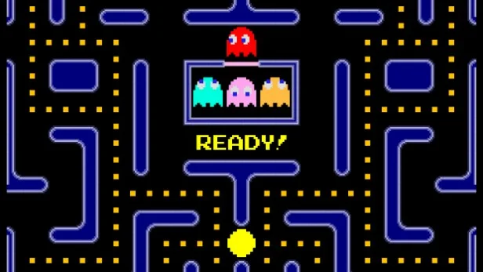

# 🟡 Pac-Man

> Bootstrap :  
> 🔗 https://github.com/shodo-nantes/kata-starters

Pac-Man est l'un des jeux vidéos les plus connus

Pac-Man, personnage emblématique de l’histoire du jeu vidéo, est un personnage en forme de rond jaune doté d’une bouche.
Il doit manger des pac-gommes et des bonus (sous forme de fruits, et d’une clé à 5 000 points) dans un labyrinthe hanté
par quatre fantômes. Quatre pac-gommes spéciales (super pac-gommes) rendent les fantômes vulnérables pendant une courte
période au cours de laquelle Pac-Man peut les manger. Les fantômes deviennent alors bleus et affichent une expression de
peur signalée par des petits yeux et une bouche en ligne cassée et quand un fantôme se fait manger, ses yeux retournent
dans la salle centrale du labyrinthe pour le faire redevenir normal.

!!! example inline end "Qu'est-ce qu'une boucle de jeu ?"

    Dans un jeu vidéo, le temps est représenté par une succession d'images ("frame") qui s'enchaînent pour nous donner l'impression de l'action.
    
    Notre objectif est de constuire la fonction permettant d'obtenir chaque "frame", avant de la faire exécuter dans une boucle.
    Le temps se compte en "ticks", ou un "tick" est un incrément de la fonction affichant chaque frame.

Le temps qui passe : une "frame" ou un "tick" (60fps => 360 frames pour 6seconds)

⇒ L'objectif de ce kata est de développer une fonction reproduisant le mécanisme de ce célèbre jeu

## 🕹️ Pac-Man dans son environnement pixélisé

Le jeu Pac-Man original s'exécute à une vitesse de 60.606061 Hz, s'effectue sur une carte de 224 pixels de large sur 248
pixels de hauteur, et est découpée en tuiles carrées de 8 pixels de côté.

Les images de Pac-Man et des fantômes font plus de 8 pixels, mais leur position effective correspond à la tuile où se
trouve le centre de leur représentation.

Au premier niveau, Pac-Man se déplace à une vitesse de 1 pixel/frame, et les fantômes de 0.9375 pixel/frame.
Lorsque les fantômes sont effrayés, Pac-Man accélère à 1.125 pixel/frame, et les fantômes sont ralentis à 0.625 pixel/frame.

Lorsque Pac-Man mange, il n'avance pas, le temps d'une frame.

## 🟡 Pac-Man dans son environnement simplifié

Les spécifications originales de Pac-Man, sont très chouette, mais ce n'est pas avec ça qu'on va réussir à se mettre en condition pour apprendre quelque chose.

Simplifions.

Pac-Man évolue dans un labyrinthe en deux dimensions, constitué de _tuiles_ (ou cases).
Certaines de ces tuiles sont pratiquables, d'autres sont infranchissables et servent de murs.
Pac-Man occupe une seule tuile et avance en permanence, en ligne droite, à la vitesse d'une tuile/frame

Avec cette modélisation, nous considérerons que la vitesse nominale du jeu est de 4 frames/secondes.  

Pac-Man peut recevoir des instructions du joueur qui le contrôle, pour changer de direction.
Il se tourne instantanément dans la direction demandée.

Le labyrinthe présente deux "warp tunnel", qui permettent à Pac-Man de passer de l'autre côté de l'écran.

### 🍕 Se nourrir

Au début de la partie, des "pac-gommes" (ou "dots"n ou "pellets") sont placés dans le labyrinthe.
Pac-Man mange les _dots_ présents sur les cases qu'il traverse.

Certaines des "pac-gommes" sont des "super-pac" (ou "super pellets"), et permettent à Pac-Man d'effrayer les fantômes pendant
un temps (24 ticks).

Lorsqu'il n'y a plus de dots dans le labyrinthe, le niveau est terminé et s'achève par la victoire de Pac-Man.

### 💯 Score

## 👻 Les fantômes

Le labyrinthe est hanté par quatre fantômes. Chacun d'eux respecte les mêmes règles de déplacement que Pac-Man :

- Ils avancent d'une case en ligne droite à chaque instant
- Ils sont bloqués par les murs
- Ils peuvent emprunter les "warp tunnel" pour passer de l'autre côté de l'écran

Lorsque Pac-Man est attrapé par un fantôme, il perd une vie. Le jeu se termine par la défaite de Pac-Man, quand Pac-Man
n'a plus de vie.

Les fantômes ont différents comportements qui évoluent dans le temps : ils alternent entre les comportements suivants :

- 🏠 Home : le comportement qu'ont les fantômes en début de partie. Ils tournent dans leur emplacement de départ quelques
  instants avant de se mettre en chasse de Pac-Man
- 😱 Frightened : quand Pac-Man mange un _pellet_, les fantômes sont effrayés et fuient Pac-Man. Si ce denier les
  attrape, ils meurent et réapparaissent à leur emplacement de départ.
- 😶‍🌫️ Scattered : les fantômes délaissent la chasse et partent dans un coin qui leur a été assigné, où ils tournent en
  boucle autour de leur coin. Ils conservent ce comportement pendant 7 secondes avant de passer en mode "Chase".
- 🎯 Chase : les fantômes chassent Pac-Man et chacun d'eux adopte un comportment qui lui est propre. Ils conservent ce
  comportement pendant 20 secondes avant de passer en mode "Scattered".

### ❤️ Blinky (fantôme rouge)

Blinky, également connu pour être l'ombre de Pac-Man, est le fantôme le plus aggressif.
Il ne passe pas de temps à rester à l'emplacement de départ en début de partie, et cible directement Pac-Man lorsqu'il
est en mode "Chasse".

Lorsqu'il est en mode dispersé (Scattered), Blinky se dirige vers le coin en haut à droite.

### 🩷 Pinky (fantôme rose)

Pinky reste 3 secondes à son emplacement de départ avant de se mettre en chasse de Pac-Man.

Lorsqu'il chasse Pac-Man, Pinky cible la case située 4 cases devant Pac-Man et cherche à s'y rendre le plus vite
possible.

Lorsqu'il est en mode dispersé (Scattered), Pinky se dirige vers le coin en haut à gauche.

### 🩵 Inky (fantôme cyan)

Inky reste 6 secondes à son emplacement de départ avant de se mettre en chasse de Pac-Man.

Lorsqu'il chasse Pac-Man, Inky cible la case symétrique à la position de Blinky, par rapport à la case située 2 cases
devant Pac-Man.

Lorsqu'il est en mode dispersé, Inky se dirige vers le coin en bas à droite.

### 🧡 Clyde (fantôme orange)

Clyde reste 6 secondes à son emplacement de départ avant de se mettre en chasse de Pac-Man.

Lorsqu'il chasse Pac-Man, Clyde le cible directement, à l'instar de Blinky. Mais dès qu'il s'approche à 8 cases ou
moins, il quitte le mode "Chasse" pour entrer dans le mode "dispersé".

Lorsqu'il est en mode dispersé, Clyde se dirige vers le coin en bas à gauche.

## 📷 Camera

Les labyrinthes sont grands et le joueur n'en voit qu'une partie. La partie visible du labyrinthe s'appelle la "caméra".

Elle est centrée sur Pac-Man, sauf quand il se rapproche trop des limites du labyrinthe et garanti au joueur un confort
de jeu.

## 💾 24k Challenge

À l'époque de sa sortie, Pac-Man pesait 24 kilobytes.

Faites en autant, ou moins, avec les technologies actuelles.

## 🔗 Ressources

* https://codingdojo.org/kata/PacMan/
* https://github.com/CodingDojoSilesia/pacman-kata
* https://fr.wikipedia.org/wiki/Pac-Man
* https://pacman.fandom.com/wiki/