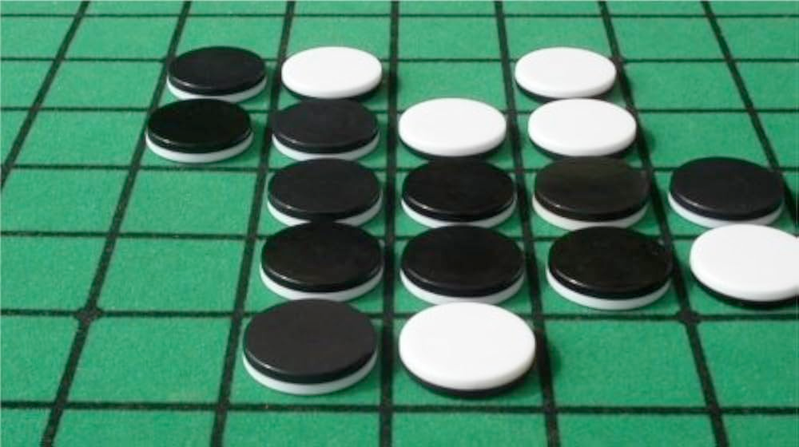

# 🌓 Reversi



> Bootstrap : <br>
> 🔗 https://github.com/shodo-nantes/kata-starters

Reversi est un jeu de société pour deux joueurs qui se joue sur un plateau de 8x8 cases avec 64 pions bicolores (noir et
blanc).

Les joueurs jouent alternativement en plaçant un pion qui doit obligatoirement encadrer une ligne de pions adverses (
horizontalement, verticalement ou diagonalement) entre le nouveau pion et un pion déjà posé de sa couleur, retournant
ainsi tous les pions adverses capturés.

La partie se termine lorsque aucun joueur ne peut jouer, le gagnant étant celui qui possède le plus de pions de sa
couleur sur le plateau.

⇒ **Ce kata consiste à écrire un programme permettant de jouer au Reversi à deux joueurs**

Le jeu commence avec cet état de départ :

```
. . . . . . . .
. . . . . . . .
. . . . . . . .
. . . B W . . .
. . . W B . . .
. . . . . . . .
. . . . . . . .
. . . . . . . .
B
```

* Les cases centrales sont occupées par les pions des deux joueurs
* C'est le joueur noir qui commence

## ⚖️ Déterminer les coups légaux

Écrire une fonction qui prend en entrée la disposition actuelle du plateau, ainsi que le joueur dont c'est le tour, et
qui renvoie une liste des coups légaux pour ce joueur.

Un coup sur une case est légal s'il existe une ligne continue de pions adverses qui se termine par un de vos propres
pions dans les 8 directions possibles (haut, bas, gauche, droite et les 4 diagonales) .

Au début de la partie, une représentation _possible_ des coups légaux pourrait ressembler à ceci :

```
. . . . . . . .
. . . . . . . .
. . . . 0 . . .
. . . B W 0 . .
. . 0 W B . . .
. . . 0 . . . .
. . . . . . . .
. . . . . . . .
B
```

Si un joueur ne peut pas capturer de pion(s) adverse(s), il est contraint de passer son tour.

## ♟️ Placer un pion

Lorsque vous placez un pion sur une case légale, vous devez retourner tous les pions adverses encadrés dans toutes les
directions valides simultanément. Un seul coup peut donc capturer des pions dans plusieurs directions à la fois.

## 🏁 Fin de la partie

Si aucun des deux joueurs ne peut jouer, ou si le plateau ne comporte plus de case vide, la partie s'arrête.
Le gagnant en fin de partie est celui qui possède le plus de pions.

## 🤖 IA

Créez un adversaire artificiel qui va jouer des coups en fonction de sa stratégie.

Les IA pour Reversi utilisent généralement des stratégies basées sur le contrôle des coins (positions les plus
précieuses), la mobilité (nombre de coups possibles), et l'évaluation de positions à l'aide d'algorithmes comme Minimax
avec élagage alpha-bêta.

Les programmes avancés peuvent battre les meilleurs joueurs humains.

## 🔀 Variantes

### Hexagonal

Cette variante se joue sur un plateau hexagonal où chaque case a 6 voisins au lieu de 8. Les règles de base restent
identiques, mais la géométrie hexagonale modifie considérablement la stratégie et les patterns de jeu.

### 3 joueurs

Dans cette variante, trois joueurs s'affrontent avec des pions tricolores.

Un coup est légal si le pion posé, encadre une ligne de points adverses, qu'ils appartiennent à un seul ou plusieurs adversaires.

## 🔗 Ressources

* https://codingdojo.org/kata/Reversi/
* https://fr.wikipedia.org/wiki/Reversi
* https://reversi.fr/
* [Hexagonal Grids from Red Blob Games](https://www.redblobgames.com/grids/hexagons/)
* [The Hexareversi Project](https://www.comp.nus.edu.sg/~gem1501/year1314sem2/project/index.html)
* https://kruzno.com/hexreversi.html
* https://ryzr51o6k3r1.space.minimax.io/