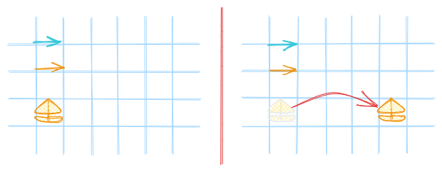
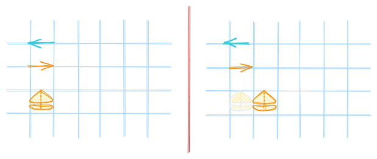
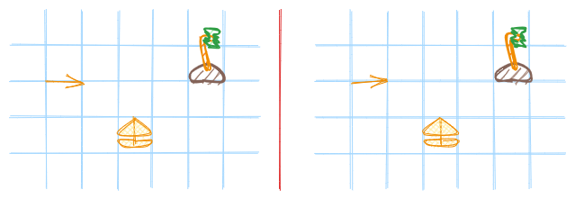

# ⛵ Sailboat Kata

> [Slides](./slides.md){:target="_blank"}

> Bootstrap :  
> 🔗 https://github.com/shodo-nantes/kata-starters

Vous êtes à la barre d'un petit voilier, qui cherche à atteindre une île. Votre bateau se déplace au tour par tour en fonction du vent, lequel change à chaque tour.

L'objectif de ce kata est de développer une fonction permettant de calculer la position du bateau à chaque tour.

## Déplacement du bateau

On modélise la position du bateau comme une grille à deux dimensions, réputée infinie.

- Si le vent et le bateau sont alignés, alors le bateau avance de 4 cases
  
-  Si le vent et le bateau sont opposés, alors le bateau avance de 1 case
  
- Si le vent et le bateau sont orthogonaux, alors le bateau avance de 2 cases, et se décale d'une case dans le sens du vent
  

## Navigation

Avant de se laisser pousser par le vent, le navigateur oriente le bateau dans le sens qui lui semble optimum pour atteindre l'île.

- Le bateau peut tourner dans le sens horaire
  
- Le bateau peut tourner dans le sens anti-horaire
  
- Le bateau ne tourne que d'un seul quart de tour à la fois
  
- Le bateau tourne dans la direction la plus avantageuse
  
- Le bateau peut conserver sa direction
  